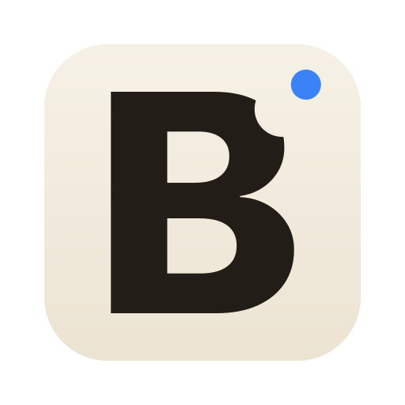
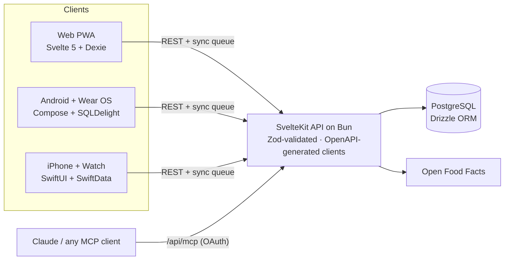

<div align="center">



# Bissbilanz

### Know every bite. Own every goal.

A calorie and macro tracker for **web, Android and iPhone** — barcode scanning, on-device
nutrition-label OCR, offline-first sync, and a food log you can hand to an AI agent.

**[Open the web app](https://bissbilanz.orellbuehler.ch/) · [Join the iOS beta](https://testflight.apple.com/join/e5Y3scbW) · [Join the Android beta](https://play.google.com/apps/testing/com.bissbilanz.android)**

[](https://github.com/OrellBuehler/bissbilanz/releases)
[](https://github.com/OrellBuehler/bissbilanz/actions/workflows/codeql.yml)
[](LICENSE)
[](https://bissbilanz.orellbuehler.ch/)
[](https://testflight.apple.com/join/e5Y3scbW)
[](https://play.google.com/apps/testing/com.bissbilanz.android)

</div>

---

## Try it

|                             |                                                                                                                                                                                                                                    |
| --------------------------- | ---------------------------------------------------------------------------------------------------------------------------------------------------------------------------------------------------------------------------------- |
| 🌐 **Web**                  | **[bissbilanz.orellbuehler.ch](https://bissbilanz.orellbuehler.ch/)** — installable PWA, works offline                                                                                                                             |
| 🍎 **iPhone / Apple Watch** | **[TestFlight beta](https://testflight.apple.com/join/e5Y3scbW)** — widgets, watch app, Apple Health, fasting Live Activity                                                                                                        |
| 🤖 **Android / Wear OS**    | **[Google Play beta](https://play.google.com/apps/testing/com.bissbilanz.android)** — opt in, then [install from Play](https://play.google.com/store/apps/details?id=com.bissbilanz.android); Wear OS app, Health Connect, widgets |

Free, no ads, no tracking SDKs, no data selling. Try the mobile apps without an account at
all — local-only mode keeps everything on device and migrates into your account if you
later sign in.

## What makes it different

**Your food log is an MCP server.** Point Claude (or any MCP client) at it and just say
what you ate. **63 tools** cover logging, foods, recipes, goals, weight, sleep,
supplements, analytics and the AI task queue — OAuth-protected, so the agent only ever sees your data.

**On-device label OCR.** No barcode? Point the camera at the nutrition table. A shared
Kotlin parser plus ML Kit reads the values locally — nothing leaves the phone.

**Offline-first, for real.** Every client writes optimistically to a local store
(Dexie on web, SQLDelight on Android, SwiftData on iOS) and drains a sync queue with
idempotency keys and last-write-wins conflict resolution. Log on a plane; it reconciles
when you land.

**43 extended nutrients.** Beyond calories and the five macros — vitamins, minerals,
amino acids — sourced from Open Food Facts and your own database.

**Actually native.** Not a wrapped web view: Jetpack Compose on Android, SwiftUI on
iPhone, plus a Wear OS app, an Apple Watch app, home- and lock-screen widgets, and
Health Connect / Apple Health integration.

## Features

|                 |                                                                                                                          |
| --------------- | ------------------------------------------------------------------------------------------------------------------------ |
| **Track**       | Calories, protein, carbs, fat, fiber + 43 extended nutrients, per meal and per day                                       |
| **Log fast**    | Barcode scanner, camera label OCR, food photos, favorites, recent foods, one-tap widgets                                 |
| **Recipes**     | Multi-ingredient recipes with automatic per-serving nutrition                                                            |
| **Beyond food** | Weight trend, sleep, supplements, fasting timer with Live Activity                                                       |
| **Insights**    | Maintenance-calorie estimate from weight trend + intake, streaks, meal timing, food diversity, sleep/food correlation    |
| **AI**          | Natural-language logging via MCP, an agent task queue in both mobile apps, on-device meal estimation from a photo on iOS |
| **Sync**        | Web, Android, iOS and watch stay in sync; conflict-safe and offline-tolerant                                             |
| **Accounts**    | Infomaniak, Google or Apple sign-in — or no account at all on mobile                                                     |
| **Languages**   | English and German                                                                                                       |

## How it fits together



The Zod validation schemas are the single source of truth: `bun run api:generate` emits
`docs/openapi.json` and from it both the TypeScript and Kotlin client models, so the web,
Android and iOS clients can't silently drift from the server.

## Talk to your food log

Bissbilanz exposes a remote MCP server at `/api/mcp` (streamable HTTP; OAuth 2.1 with PKCE; clients are provisioned in Settings → MCP,
scope `mcp:access`):

```json
{
	"mcpServers": {
		"bissbilanz": {
			"type": "http",
			"url": "https://bissbilanz.orellbuehler.ch/api/mcp"
		}
	}
}
```

Then:

> **You:** I had a chicken bowl with rice and avocado for lunch, and a flat white.
>
> **Claude:** Logged 4 items to Lunch — 812 kcal, 47 g protein. You're at 1,340 / 2,200 kcal
> and 89 / 160 g protein for the day.

Anything the app can do, the agent can do: `log_food`, `search_foods`, `create_recipe`,
`get_daily_status`, `log_weight`, `get_streaks`, `get_sleep_food_correlation` and 57 more — see [docs/mcp.md](docs/mcp.md) for the full tool, prompt and resource list and how to connect each client.

An agent can also label the food database — `list_unlabeled_foods` plus `set_food_labels_batch`
gives every food the plain English nouns a camera would call it. Labels are a search tier
everywhere (`bread` finds `Vollkornbrot`) and how the phone matches a food from a camera frame.

## Tech stack

| Layer   | Choice                                                                                  |
| ------- | --------------------------------------------------------------------------------------- |
| Web     | SvelteKit 2 · Svelte 5 runes · Tailwind CSS 4 · shadcn-svelte · layerchart              |
| Runtime | Bun (dev and production, via `svelte-adapter-bun`)                                      |
| Data    | PostgreSQL · Drizzle ORM · versioned migrations applied on boot                         |
| Mobile  | Kotlin Multiplatform shared core · Jetpack Compose · SwiftUI · Ktor · SQLDelight · Koin |
| Offline | Dexie (web) · SQLDelight (Android) · SwiftData (iOS) · idempotent sync queue            |
| AI      | Model Context Protocol SDK · Apple Foundation Models (on-device)                        |
| Quality | Vitest · Playwright · Testcontainers · CodeQL · Semgrep · Trivy · Gitleaks              |

## Repository layout

```
src/               SvelteKit app — routes, API, server logic, Drizzle schema
  lib/server/      auth, validation, MCP server, sync, security
mobile/
  shared/          Kotlin Multiplatform core (models, API client, repositories, DI)
  androidApp/      Jetpack Compose app
  wearApp/         Wear OS app
  iosApp/          SwiftUI app + widgets + Apple Watch app
drizzle/           SQL migrations and snapshots
crawler/           base food catalog importer
tests/             unit, integration (Testcontainers) and Playwright e2e suites
analytics-parity/  golden vectors keeping the TS and Kotlin analytics in step
scripts/           codegen, security scans, release helpers
store/             App Store and Play Console metadata
docs/              generated OpenAPI spec and the MCP guide
```

## Development

Requires [Bun](https://bun.sh), PostgreSQL, and OAuth credentials for at least one
sign-in provider (see `.env.example`).

```bash
bun install
cp .env.example .env       # fill in DATABASE_URL, SESSION_SECRET, an OIDC provider
bun run dev                # migrations run automatically on start
```

```bash
bun run check              # svelte-check + prettier
bun test                   # unit tests
bun run test:integration-db # DB integration tests (Testcontainers, needs Docker)
bun run test:mobile        # Playwright e2e
bun run api:generate       # regenerate OpenAPI spec + TS/Kotlin clients
bun run analytics:check    # verify the TS/Kotlin analytics parity vectors
bun run constants:check    # verify the generated shared constants
bun run security           # Semgrep + bun audit + Trivy
```

Android:

```bash
cd mobile && ./gradlew androidApp:assembleDebug
```

iOS requires macOS with Xcode; the shared KMP module builds as a static framework.

## Support

Bissbilanz is free, with no ads and nothing to unlock. If it is useful to you, you can help
cover hosting on the [support page](https://bissbilanz.orellbuehler.ch/#support) or via
[GitHub Sponsors](https://github.com/sponsors/OrellBuehler) — entirely voluntary, and it
changes nothing in the app. Bugs and requests go to
[issues](https://github.com/OrellBuehler/bissbilanz/issues); security reports follow
[SECURITY.md](SECURITY.md).

## License

[PolyForm Noncommercial 1.0.0](LICENSE) — free to use, modify and share for any
noncommercial purpose. Commercial use requires a separate license.

---

<div align="center">
<sub>Built by <a href="https://github.com/OrellBuehler">Orell Bühler</a> · nutrition data from <a href="https://world.openfoodfacts.org/">Open Food Facts</a></sub>
</div>
